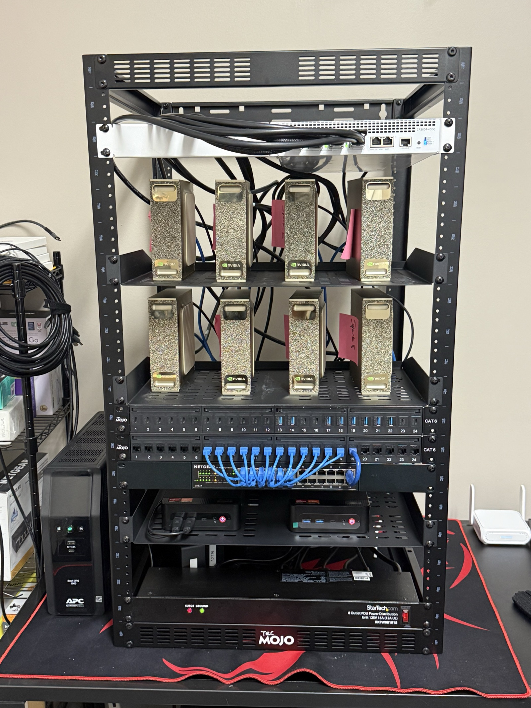

# DGX Cluster Engineering Record

This repository is the privacy-reviewed public record of how I brought up, repaired, tuned, and revalidated a local eight-system DGX Spark cluster. The measurements and engineering conclusions are real. Hostnames, addresses, physical port labels, and control mappings are sanitized public aliases so the work remains reviewable without exposing the live environment.

## Physical implementation evidence




The visual record now follows the power-supply support from the original heat
pocket through dimensional test prints, final production parts, installation,
and fan placement. I reviewed and approved the visible rack labels and cabling
in these photographs. See
[THERMAL-MANAGEMENT.md](docs/THERMAL-MANAGEMENT.md) for the complete build and
measured fan test.

## What is here

The record follows the work in the order it happened:

1. Establish management identity before connecting the high-speed fabric.
2. Normalize the first systems to a repeatable software and firmware baseline.
3. Refuse to treat link-up as proof of useful RoCE throughput.
4. Isolate a switch forwarding failure that survived normal link, MTU, FEC, and vendor diagnostics.
5. Repair the ASIC forwarding path and prove both logical rails with directed RDMA and NCCL.
6. Tune separate four-system and eight-system NCCL profiles from repeated measurements.
7. Revalidate the entire fabric after a physical rack recable.
8. Commission rack-local BLE power control fail-closed after physical evidence disproved an early decoder assumption.
9. Design and print rack-mounted PSU supports, place the fan below the raised bricks, and prove the fan control path with a bounded temperature test.

## Recorded results

These are historical observations from the engineering record, not current service guarantees.

| Milestone | Recorded result |
| --- | --- |
| Initial four-system TCP baseline | roughly `9.3-9.43 Gbit/s`, with retransmits |
| Initial raw RDMA | roughly `0.1-7 Gbit/s` |
| Direct-cable diagnostic | `12.8 Gbit/s` TCP and `12.71 Gbit/s` RDMA |
| Switch forwarding repair | `111.07 Gbit/s` on the repaired path |
| Dual TCP pairs after repair | `197.62`, `198.00`, and `196.61 Gbit/s`, with zero retransmits |
| Sequential RDMA after repair | `97.98 Gbit/s` on each logical rail |
| Full post-rewire directed RDMA | `112/112` ordered pairs, mean `109.20 Gbit/s` |
| Tuned eight-system NCCL at 256 MiB | mean `22.9965 GB/s`, wrong `0` |
| Later rack revalidation | jumbo `112/112`; RDMA `112/112` after bounded serial retry; NCCL `23.8196 GB/s`, wrong `0` |
| Bounded rack-fan proof | `82.4 F` fan-ON baseline; `82.8 F` after two minutes OFF; `82.5 F` after ON recovery |

The detailed context, failed hypotheses, and acceptance boundaries are preserved in the linked records. I do not flatten a long diagnosis into a benchmark screenshot.

## Repository map

| Path | Contents |
| --- | --- |
| [docs/CASE-STUDY.md](docs/CASE-STUDY.md) | Chronological engineering narrative |
| [docs/MEDIA-REVIEW.md](docs/MEDIA-REVIEW.md) | Published visual evidence and review record |
| [docs/ARCHITECTURE.md](docs/ARCHITECTURE.md) | Sanitized architecture and validation flow |
| [docs/COMMISSIONING.md](docs/COMMISSIONING.md) | Identity-first bring-up and parity gates |
| [docs/FABRIC-TROUBLESHOOTING.md](docs/FABRIC-TROUBLESHOOTING.md) | RoCE diagnosis, forwarding root cause, repair, and rollback discipline |
| [docs/NCCL-TUNING-RECORD.md](docs/NCCL-TUNING-RECORD.md) | Four-system and eight-system profiles with measured results |
| [docs/RACK-RECABLE-REVALIDATION.md](docs/RACK-RECABLE-REVALIDATION.md) | Post-rewire fault and complete acceptance rerun |
| [docs/POWER-BLE-COMMISSIONING.md](docs/POWER-BLE-COMMISSIONING.md) | Raspberry Pi BLE work and the fail-closed correction |
| [docs/RECOVERY-POLICY.md](docs/RECOVERY-POLICY.md) | Guarded recovery decision and refusal logic |
| [docs/THERMAL-MANAGEMENT.md](docs/THERMAL-MANAGEMENT.md) | PSU-support design, print iterations, fan placement, and measured differential test |
| [docs/SOURCE-ADAPTATION.md](docs/SOURCE-ADAPTATION.md) | What was preserved and what was sanitized |
| [examples/sanitized-cluster-aliases.json](examples/sanitized-cluster-aliases.json) | Internally consistent public aliases |
| [examples/nccl-profiles.json](examples/nccl-profiles.json) | Recorded tuning profiles and public-safe launcher aliases |
| [examples/recovery-policy.json](examples/recovery-policy.json) | Machine-readable guarded policy example |
| [scripts/summarize_nccl_log.py](scripts/summarize_nccl_log.py) | Local parser for `nccl-tests` output |
| [scripts/check_publication_safety.py](scripts/check_publication_safety.py) | Fail-closed publication scan |

## Architecture boundary

The public diagram uses `spark-a.example` through `spark-h.example` and RFC 5737 documentation addresses. Those aliases preserve the management-plane and dual-rail relationships, but they do not reproduce live identity, addressing, switch-port numbering, power mapping, or remote-access endpoints.

The interface and transport names are retained because they explain the engineering result:

```text
NCCL_IB_HCA=rocep1s0f1,roceP2p1s0f1
NCCL_SOCKET_IFNAME=enp1s0f1np1,enP2p1s0f1np1
UCX_NET_DEVICES=enp1s0f1np1,enP2p1s0f1np1
```

## How I treat evidence

- A management ping is not a workload-health result.
- A physical `200G` link is not proof of application throughput.
- A protocol acknowledgement is not proof that the intended relay moved.
- A one-off peak is not a frozen tuning profile.
- A repair is not complete until the original gate is rerun and the rollback is recorded.
- Unknown state stays unknown. It is not converted into green status for convenience.

## Publication boundary

The private working repository remains the operational source of truth. This public repository omits credentials, accounts, personal paths, raw captures, raw logs, hardware identifiers, controller identities, exact physical mappings, and current operational status. It preserves non-identifying measurements and engineering decisions because those are the substance of the work.

Reviewed visual evidence is kept under `media/review/`. Each asset is
metadata-scrubbed and manually inspected before publication. Publishing a rack
overview does not disclose or authorize publication of an exact control
relationship, power map, or live topology.

See [docs/PUBLICATION-SAFETY.md](docs/PUBLICATION-SAFETY.md) for the enforced boundary.

## Limitations

- The measurements describe the recorded test conditions, not every workload or software version.
- The public aliases are not valid deployment inventory.
- The BLE work proves an identity-verified read path and a critical decoder correction; it does not claim unattended relay recovery is enabled.
- The fan test proves a bounded control-path and temperature response. It is not a CFM study, long-duration thermal-capacity test, or maximum safe workload claim.
- This repository is published without an open-source license.

## Copyright

Copyright (c) 2026 Gumbii Digital. All rights reserved. See
[COPYRIGHT.md](COPYRIGHT.md) for the publication and reuse terms.
