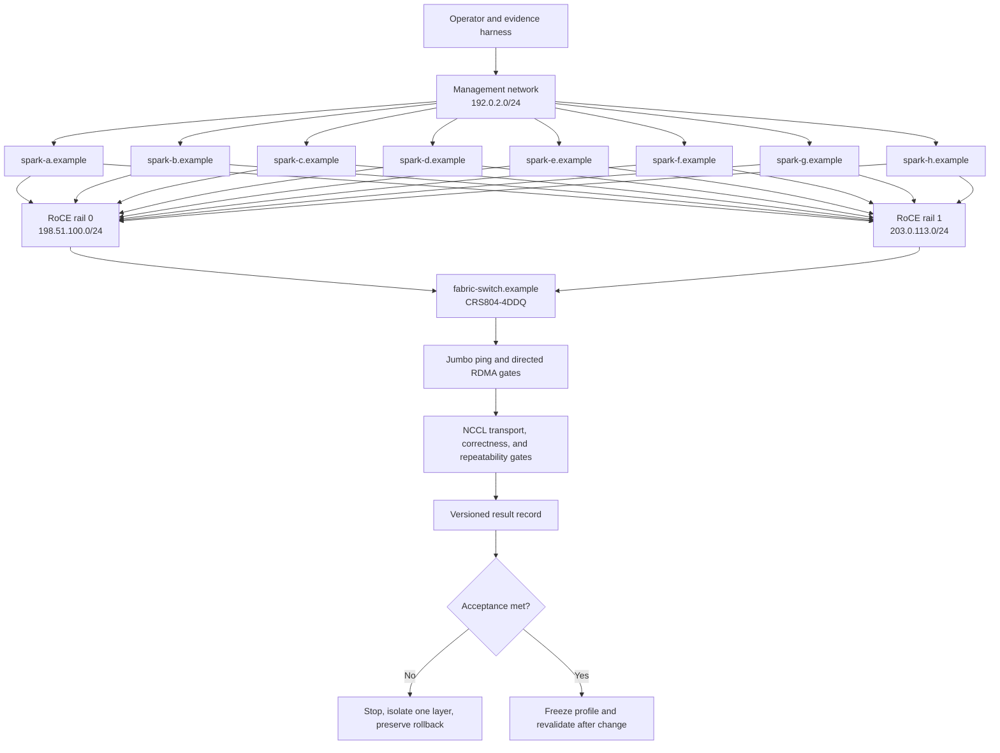

```mermaid
flowchart TB
  O["Operator and evidence harness"] --> M["Management network<br/>192.0.2.0/24"]
  M --> A["spark-a.example"]
  M --> B["spark-b.example"]
  M --> C["spark-c.example"]
  M --> D["spark-d.example"]
  M --> E["spark-e.example"]
  M --> F["spark-f.example"]
  M --> G["spark-g.example"]
  M --> H["spark-h.example"]
  A & B & C & D & E & F & G & H --> R0["RoCE rail 0<br/>198.51.100.0/24"]
  A & B & C & D & E & F & G & H --> R1["RoCE rail 1<br/>203.0.113.0/24"]
  R0 --> S["fabric-switch.example<br/>CRS804-4DDQ"]
  R1 --> S
  S --> V["Jumbo ping and directed RDMA gates"]
  V --> N["NCCL transport, correctness, and repeatability gates"]
  N --> EVIDENCE["Versioned result record"]
  EVIDENCE --> DECISION{"Acceptance met?"}
  DECISION -->|"No"| STOP["Stop, isolate one layer, preserve rollback"]
  DECISION -->|"Yes"| FREEZE["Freeze profile and revalidate after change"]
```
