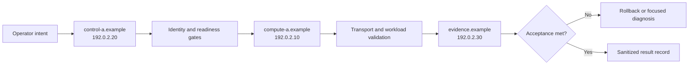

```mermaid
flowchart LR
  O["Operator intent"] --> C["control-a.example<br/>192.0.2.20"]
  C --> I["Identity and readiness gates"]
  I --> N["compute-a.example<br/>192.0.2.10"]
  N --> V["Transport and workload validation"]
  V --> E["evidence.example<br/>192.0.2.30"]
  E --> A{"Acceptance met?"}
  A -->|No| R["Rollback or focused diagnosis"]
  A -->|Yes| D["Sanitized result record"]
```
