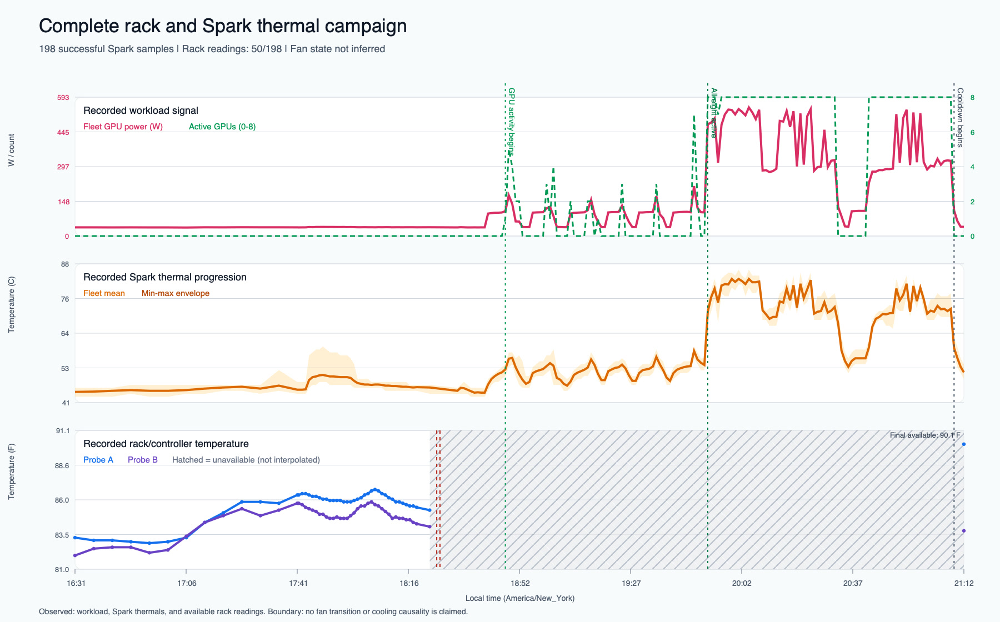

# Rack thermal control, controller failures, and GLM-5.2 campaign

## Complete incident and recovery record

**Campaign date:** July 25-26, 2026

**Scope:** Rack-temperature observation, Power B outlet 2 fan validation, controller-I/O triage, guarded edge testing, and the eight-Spark GLM-5.2 workload capture.

**Evidence boundary:** This report uses the saved controller, runner, thermal, and Spark telemetry artifacts. It distinguishes recorded observations from interpretation. It does not infer missing fan states or interpolate missing rack temperatures.

## Technical summary

The project began as a practical rack-cooling test: observe the rack temperature, turn the fan on Power B outlet 2 off for a bounded interval, restore it, and measure the difference while the eight Sparks moved from idle to sustained GLM-5.2 inference and back to idle.

The work exposed three different classes of failure:

1. **Measurement error:** one probe briefly sat in a Spark exhaust stream. Readings above 100 F represented a local exhaust pocket, not the whole rack.
2. **Controller-request congestion:** the first stepped fan test successfully turned B2 off, but a later read-only request waited behind other serialized BLE work and exceeded the client's timeout. The daemon and controllers did not crash. The experiment failed closed and restored B2 to continuous ON.
3. **Later controller unavailability during the GLM campaign:** both controller snapshots became unavailable. The saved evidence does not establish the root cause. A Spark-only fallback collector preserved workload and Spark temperature data until controller readings returned in the final sample.

The final campaign contains 200 records: 198 successful Spark samples and two failed collection samples. It captured the complete workload bring-up, an all-eight-active interval, peak Spark temperatures, workload removal, and cooldown. Rack/controller temperatures exist for 50 successful samples, or 25.253% coverage. The other 148 successful samples retain Spark telemetry but have no rack temperature.

The campaign is strong evidence for workload and Spark thermal progression. It is **not** sufficient evidence for a numerical fan-cooling effect because fan relay transitions were not recorded in the campaign samples and rack coverage is incomplete.

## What I was trying to prove

The intended test had four parts:

1. Establish a stable rack-temperature baseline with the fan running.
2. Turn only Power B outlet 2 off for a bounded interval while leaving every protected relay untouched.
3. Observe how quickly the rack warmed and then recovered after B2 returned to continuous ON.
4. Repeat observation while all eight Sparks ran the GLM-5.2 workload, then capture the cooldown after the workload stopped.

The fan was the only relay in scope. Every other outlet was treated as protected. A controller error, stale state, unknown readback, alarm, overload, or protected-relay drift was supposed to refuse the test and keep or restore B2 ON.

## Chronological record

### 1. Passive two-hour observation

The first passive series ran from `2026-07-25T01:21:50Z` through `03:21:50Z`. It completed 94 samples with no sampling errors. The series recorded a maximum Spark temperature of 85 C.

An early probe reading rose from 101.5 F to 103.9 F and then 104.7 F. That was initially alarming, but inspection showed that the probe had been placed near a Spark exhaust path. Repositioning it produced a sharp reduction. The correction was to treat those values as evidence of a **local hot pocket and probe-placement sensitivity**, not as the ambient temperature of the rack.

This was the first important mistake: the sensor was reading exactly what it was exposed to, but the physical placement did not represent the quantity we wanted to measure.

### 2. First controlled B2 fan-off test

The stepped test passed preflight at `01:52:43Z`. Before any relay action, it armed an independent eight-minute restore timer. The B2 OFF command completed at `01:53:02Z` with verified physical readback.

The dedicated runner recorded:

- one fan-on baseline sample: Power B probe 80.4 F; Spark mean 53.5 C;
- one fan-off sample: Power B probe 83.2 F; Spark mean 50.625 C;
- maximum runner-observed rack value: 90.0 F;
- maximum runner-observed Spark value: 70 C.

The independent passive observer also saw B2 physically OFF. At `01:53:31Z`, it recorded Power B at 91.7 F, rack maximum 91.7 F, Spark mean 49.125 C, and hottest Spark 54 C. This showed residual exhaust heat accumulating rapidly near the probe even while Spark temperatures were not rising.

At `01:54:07Z`, a later read-only controller request timed out. The planned five-minute OFF window did not complete. The runner aborted and entered its finalizer. B2 was restored to continuous ON at `01:54:26Z`. At `01:54:58Z`, the passive observer recorded Power B at 84.8 F and rack maximum at 86.2 F.

This test did **not** fail because the OFF write failed. The OFF command and physical readback succeeded. It failed because a later observation request exceeded its client-side wait while controller operations were serialized.

### 3. Diagnosing the first controller incident

The daemon did not restart. Its Unix sockets remained present and listening. Both controllers were readable after the timeout, and neither reported alarm or overload. This ruled out the strongest early hypotheses: controller crash, daemon crash, overload, and failed BLE relay write.

The diagnosed cause was request-queue contention:

- controller reads and writes share one global lock;
- BLE exchanges are serialized to prevent a read from interposing inside a relay action;
- the thermal runner, passive observer, and scheduled triage poll could all request full controller snapshots;
- the client allowed 30 seconds and the outer runner allowed 40 seconds;
- a queued read exceeded that window even though the daemon and controllers remained healthy.

The timestamps and code structure establish queue contention. They do not establish the exact ordering of individual waiters because that ordering was not logged.

### 4. Corrective controller controls

The recovery work preserved serialization and widened only the observation path:

- observation clients now allow 150 seconds;
- the daemon applies its own 120-second controller-I/O limit;
- thermal runners allow 180 seconds around a controller read;
- the scheduled triage poll yields the controller lane during an explicit fan-validation maintenance window.

If the daemon's 120-second bound expires, it now:

- returns HTTP 503;
- enters maintenance;
- increments a controller-I/O timeout counter;
- exposes `ControllerIoTimeout` through health status;
- issues no relay command and infers no relay state.

Other failure classes remain separate. A daemon exit invokes systemd restart and incomplete-journal checks. Controller unavailability enters typed triage and maintenance. Alarm, overload, identity uncertainty, mapping uncertainty, or missing relay acknowledgement quarantines writes. A verified B2 OFF state outside a supervised test can restore only B2 to continuous ON. Compute recovery remains separately gated.

Validation after the correction produced:

- 59 targeted controller, CLI, and triage tests passed;
- 243 full-package tests passed;
- four deployed-source compatibility tests passed;
- Python compilation and whitespace checks passed;
- the service was active and running;
- no active controller request, waiter, timeout, or last error remained;
- all 16 relay readbacks were ON, including B2 continuous ON;
- no outlet command was issued during the corrective deployment.

### 5. Rerun/idempotency mistake

A separate relaunch attempt failed with `FileExistsError` because the runner used a fixed output directory and attempted to create it again with exclusive creation semantics.

This was not a BLE or controller failure. It was an experiment-runner idempotency defect. The operational lesson is that each run needs a unique run directory or an explicit resume/reject policy before any hardware step begins.

### 6. Five-minute cooldown and guarded edge monitoring

A later five-minute series collected 25 samples with no collection errors. Its rack readings ranged from 86.5 F to 92.4 F. The first sample was not an idle baseline: the GPUs were still at 93-96% utilization, the Sparks ranged from 69 C to 85 C, and B2 was ON.

By the second sample, the fleet mean Spark temperature fell from 77.125 C to 55.25 C, although the hottest Spark remained at 82 C. This proved that cooldown had started, but not that the fleet had reached a stable baseline.

The two-hour B2 edge monitors then refused every proposed OFF cycle when safety gates were not satisfied:

- one run recorded four refusals and zero errors;
- a second recorded 25 refusals and zero errors;
- the continuous run recorded 14 refusals, zero errors, and no completed relay actions.

The paired continuous thermal sampler collected 14 samples with no errors. Rack temperature ranged from 84.5 F to 87.5 F. The last sample recorded 84.9 F, with the hottest Spark at 45 C and the fan ON.

These runs proved the **refusal and containment path**, not cooling causality. The system left protected relays unchanged and declined unsafe fan-off actions.

### 7. Automatic baseline and GLM prelude

An additional automatic baseline collected eight samples with no errors. Rack temperature ranged from 82.6 F to 93.7 F while the hottest Spark remained between 44 C and 46 C. The samples did not contain readable fan relay state, so no fan-on/fan-off conclusion can be drawn from that range.

The GLM prelude then collected 13 lower-rate samples. Rack temperature ranged from 82.9 F to 86.4 F, and the hottest Spark ranged from 46 C to 52 C.

### 8. Full eight-Spark GLM-5.2 campaign

The complete campaign began at `2026-07-25T16:31:34-04:00` and ended at `21:12:39-04:00`, a duration of 16,865.183 seconds, or about 4 hours 41 minutes.

The record contains:

- 200 total records;
- 198 successful Spark samples;
- two failed collection samples;
- 79 samples with active GPUs;
- 62 samples with all eight GPUs active;
- 50 successful samples with rack/controller temperature;
- 148 successful Spark samples without rack/controller temperature;
- a median successful-sample interval of 65.191 seconds.

The observed workload milestones were:

- first GPU activity: `18:47:38-04:00`;
- first all-eight-active sample: `19:51:40-04:00`;
- final GPU activity: `21:08:30-04:00`;
- cooldown marker: `21:09:33-04:00`;
- campaign end: `21:12:39-04:00`.

Observed peaks were:

| Measurement | Peak | Time |
| --- | ---: | --- |
| Fleet GPU power | 549.11 W | `20:04:40-04:00` |
| Fleet mean Spark temperature | 82.875 C | `19:59:14-04:00` |
| Hottest individual Spark | 86.0 C | `20:01:25-04:00` |
| Highest available rack reading | 90.1 F | `21:12:39-04:00` |

The workload phases are derived only from recorded utilization. The threshold for an active GPU was 10% utilization. Cooldown was marked at the first of three consecutive zero-active-GPU samples after the final active sample.

### 9. B2 edge probe refusal during the GLM campaign

Before the edge probe, the controller reported B2 mode as continuous ON but its physical relay state was unknown. The safety system armed an independent restore timer but issued no relay change. The probe was refused because the required relay readback was unavailable.

A later restore request also refused with HTTP 409 because the read-only policy only permits restoration of a verified OFF compute outlet. That refusal was correct: the software would not invent an OFF state or write to an outlet based on an assumption.

The saved event records the result plainly: `relay_changed: false`, with the reason that B2 relay readback was unknown.

### 10. Later controller unavailability and fallback capture

After the refused edge probe, two resumed collection attempts failed because the controller snapshot was not available. Subsequent triage recorded both controllers as unavailable. A bounded BlueZ restart did not immediately restore controller access.

The exact cause of this later unavailability is not established by the saved evidence. It must not be collapsed into the earlier lock-contention diagnosis without additional proof.

The recovery decision was to preserve the test without touching relays: a Spark-only fallback collector continued recording GPU utilization, GPU power, and Spark temperatures. It produced 149 successful fallback samples. In 148 of those, controller/rack readings remained unavailable. The final sample again contained a successful controller snapshot and a rack reading.

At the final sample:

- no GPUs were active;
- fleet GPU power was 39.14 W;
- mean Spark temperature was 51.25 C;
- hottest Spark was 54 C;
- available rack temperature was 90.1 F;
- controller status was readable again.

The fallback preserved the workload and cooldown evidence. It did not repair the missing rack history, and that history was not reconstructed or interpolated.

### 11. Reporting mistake: incomplete and visually misleading first graph

The first generated summary and graph were built before the campaign's final records had been incorporated. They omitted roughly the final 34 minutes through `21:12:39-04:00`.

The first chart also connected rack-temperature lines across missing controller periods. That presentation implied continuous rack measurement where none existed. One gap was labeled, but the visualization still overstated continuity.

The correction was a full offline rebuild from all immutable source logs:

- all 200 records were included;
- missing rack intervals were left blank and shown as hatched bands;
- rack lines were broken rather than interpolated;
- the final standalone rack point was made visible;
- numeric axes were added after visual review;
- source logs remained unchanged;
- graph-ready CSV, machine-readable summary, provenance, SVG, and PNG outputs were regenerated.

### 12. Derivative-generation mistakes and recovery

The first rendering attempt used a bundled Python runtime that did not include Matplotlib. It failed with `ModuleNotFoundError` before changing any evidence file.

The recovery was a dependency-free SVG renderer. The first SVG-to-PNG conversion used `qlmanage`, which produced an unwanted square, padded result. The conversion was replaced with `sips`, producing the intended 1800 by 1120 image.

Visual review then caught two additional presentation problems: missing numeric y-axis scales and an effectively invisible final one-point rack reading. Both were fixed before the derivative was accepted.

Final derivative validation confirmed:

- 198 successful rows in the public graph CSV;
- all five source hashes matched;
- SVG XML was valid;
- the Markdown image reference resolved;
- the public-facing derivative passed its identifier scan;
- source modification times were unchanged.

## Mistakes and recoveries at a glance

| Mistake or failure | What actually happened | Recovery | Durable lesson |
| --- | --- | --- | --- |
| Probe placed near Spark exhaust | Local exhaust exceeded 100 F and was initially easy to misread as rack ambient | Repositioned probe; reclassified readings as local hot-pocket evidence | Sensor placement is part of the measurement definition |
| Short client timeout | A valid serialized read waited longer than the 30-second client window | Added 150/120/180-second layered bounds and explicit health/maintenance behavior | Queue delay and device failure must be reported separately |
| Planned five-minute fan-off test aborted early | B2 OFF succeeded; later observation timed out | Finalizer and independent restore returned B2 to continuous ON | Hardware mutation needs an independent restoration path |
| Reused output directory | Runner failed before a new test with `FileExistsError` | Identified as runner idempotency defect | Every physical test needs a unique run ID or explicit resume policy |
| Unsafe edge conditions | Relay state or rack gate was uncertain | Refused actions; protected relays remained unchanged | Unknown state must not be converted into an assumed safe state |
| Both controller snapshots later unavailable | Rack temperature disappeared during the workload | Spark-only fallback preserved compute telemetry; controller data returned in final sample | Degrade measurement scope instead of inventing missing data |
| Early graph omitted final data | Summary was generated before all records were included | Rebuilt from all immutable logs | Completion requires final-record and coverage verification |
| Rack line crossed missing periods | Chart visually implied continuous data | Broke lines and hatched missing intervals | A graph must make data absence visible |
| Matplotlib unavailable | First renderer could not start | Used dependency-free SVG generation | Derivative tooling should fail before altering evidence |
| First PNG conversion was malformed | Quick Look produced a square/padded image | Converted with `sips`; visually inspected dimensions | Machine validation does not replace visual QA |

## What the evidence supports

The saved evidence supports these conclusions:

1. All eight Sparks were captured moving from low activity into sustained GLM-5.2 activity and back to zero active GPUs.
2. The hottest Spark reached 86 C and the fleet mean reached 82.875 C under the recorded workload.
3. A short, supervised B2 fan-off interval coincided with a rapid rise in a nearby rack probe and a lower reading after B2 was restored.
4. The first timeout was a queued controller-read timeout, not a failed relay write or daemon/controller crash.
5. The independent restore and finalizer returned B2 to continuous ON after the aborted test.
6. Guarded edge monitors repeatedly refused unsafe actions without touching protected relays.
7. Spark telemetry continued during later controller unavailability because the fallback path separated compute observation from controller observation.
8. The corrected chart accurately shows all captured Spark/workload data and explicitly exposes missing rack coverage.

## What the evidence does not support

The saved evidence does **not** support these claims:

1. It does not establish a repeatable number of degrees of rack cooling caused by the fan.
2. It does not identify exact fan transition times during the GLM campaign.
3. It does not prove that the 90.1 F final rack reading was caused by the prior workload or by fan state.
4. It does not establish the root cause of the later two-controller unavailability.
5. It does not make the above-100 F exhaust-probe readings representative of the whole rack.
6. It does not justify filling the 148 missing rack samples through interpolation.

## Current operational conclusion

The guarded control design behaved safely under the failures that occurred:

- B2 could be deliberately switched and physically verified during the supervised test;
- a later observation timeout caused an abort rather than an uncontrolled continuation;
- B2 was restored to continuous ON;
- uncertain relay state caused refusal rather than a guessed write;
- protected relays were not used for edge testing;
- controller loss reduced observability but did not erase Spark telemetry;
- the complete historical dataset is now preserved in a graphable, provenance-backed derivative.

The incomplete part is the fan-effect experiment. A defensible cooling delta requires a new campaign that records controller/rack temperature and verified B2 relay state together at every transition, repeats comparable ON and OFF windows, and maintains stable probe placement and workload conditions.

## Recommended next test

If a new live campaign is authorized, it should be treated as a separate experiment:

1. Lock and photograph the single rack-probe position before starting.
2. Use a unique timestamped run directory and refuse accidental reuse.
3. Record B2 command receipt, physical relay readback, controller health, rack temperature, Spark temperatures, GPU utilization, and GPU power in the same sample stream.
4. Keep the independent B2 ON restore timer armed before every OFF command.
5. Require all protected relays to match their frozen baseline before and after every action.
6. Run repeated, equal-duration ON and OFF windows under a comparable workload.
7. Abort and restore B2 ON on stale data, unknown relay state, alarm, overload, controller error, or protected-relay drift.
8. Publish the raw coverage count and every missing interval with the result.

That future test could quantify fan response. The present campaign should be published as a complete workload/thermal progression with a well-documented controller-observability failure and recovery, not as proof of fan cooling efficiency.

## Public evidence inventory

This public addendum contains:

- `docs/THERMAL-CAMPAIGN-INCIDENT-RECOVERY-2026-07-25.md` - this full incident, mistake, and recovery record;
- `media/review/14-complete-thermal-campaign.jpg` - metadata-scrubbed public chart.

The graph-ready CSV, machine-readable summary, provenance ledger, source hashes, and raw controller/Spark logs remain in the private evidence archive. They were used to validate this report but are not published because the operational archive exceeds the public disclosure boundary.

No live sampler was restarted and no controller, relay, workload, service, Bluetooth stack, or network setting was changed to produce this report.
