# Open-Rack Thermal Management

## The heat pocket

The rack was left open deliberately. I needed direct access to the Sparks,
power supplies, cabling, and fabric while I was still changing the system.

The middle and lower rack initially concentrated the PSU bricks and cable loops
on the rack surfaces. The bricks ran warm, the pile restricted the open path
through the center of the rack, and the arrangement created the heat pocket I
wanted to remove.

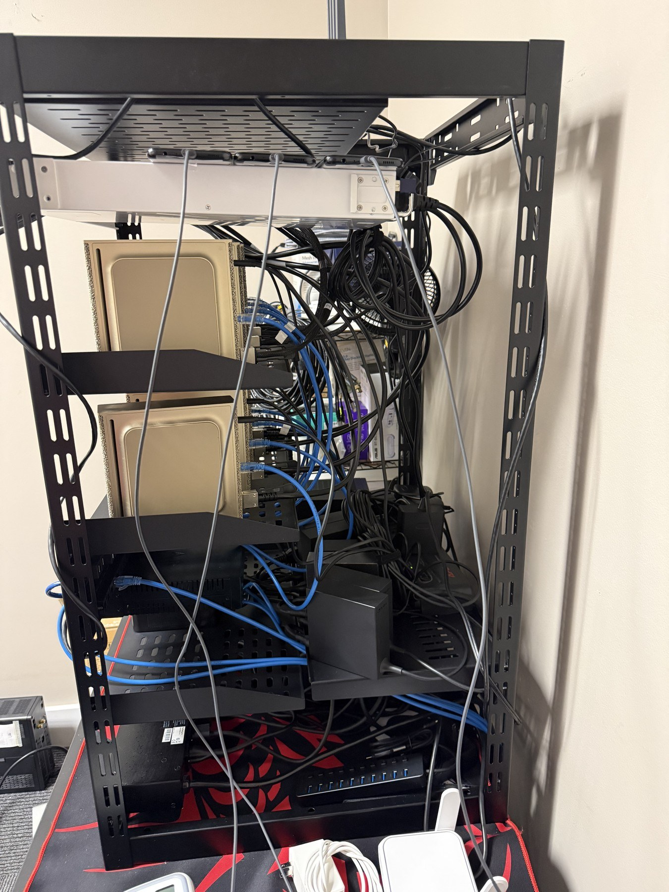

The mechanical goal was straightforward: lift every PSU off the shelf, hold it
securely against the rack structure, keep both cable ends serviceable, and leave
open space below the bricks so the fan could move room air upward.

## First full prototype

The orange print proved that the PSU body, cable bend, and connector clearance
fit the model.

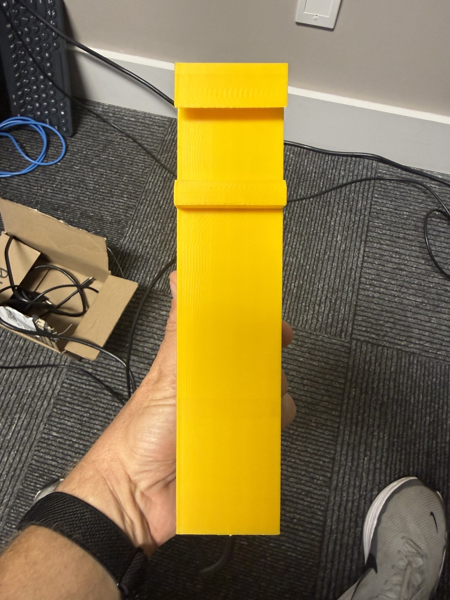

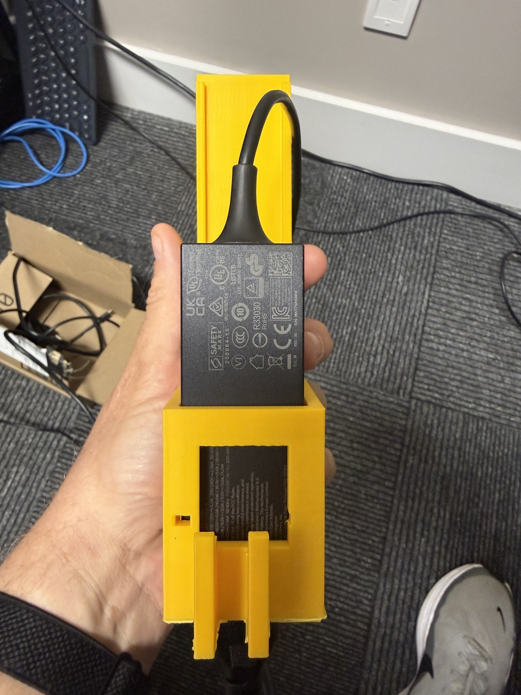

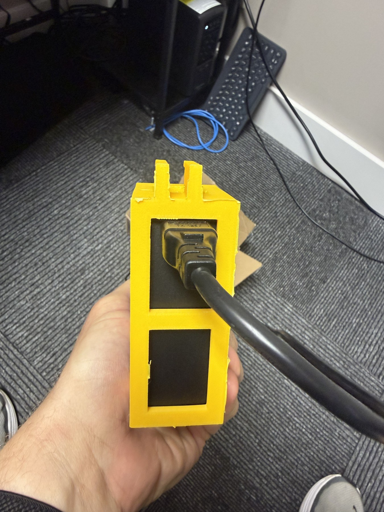

The PSU fit was right, but the rack-retention clip was not. The first clip did
not seat correctly on the shelf lip. That was a local dimensional problem, not
a reason to print the entire support repeatedly.

## Four clip measurements instead of four full reprints

I isolated the clip geometry and printed four small test pieces with four
measurements. That let me test the actual rack fit quickly, choose the correct
dimension, and move that result back into the full model.

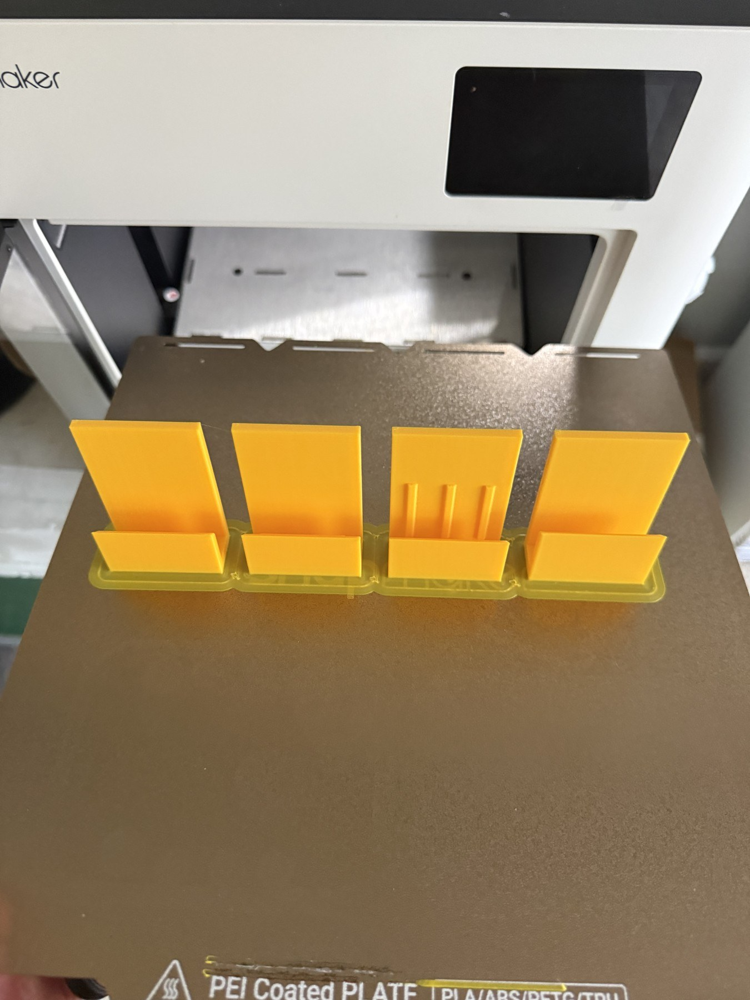

The full print required support material around the cable opening, PSU basket,
and rack-retention structure. The orange print documents that support strategy
before cleanup.

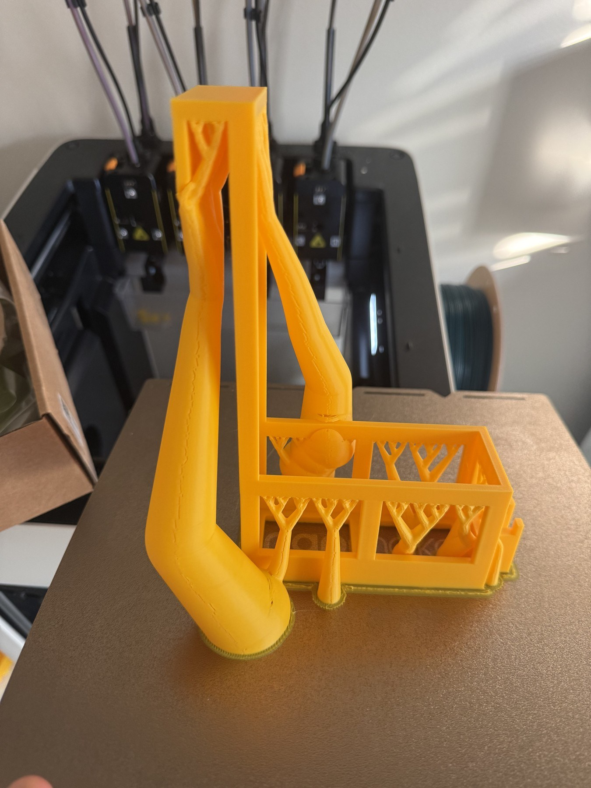

The corrected orange prototype then seated on the rack and held the PSU with
both cable paths accessible.

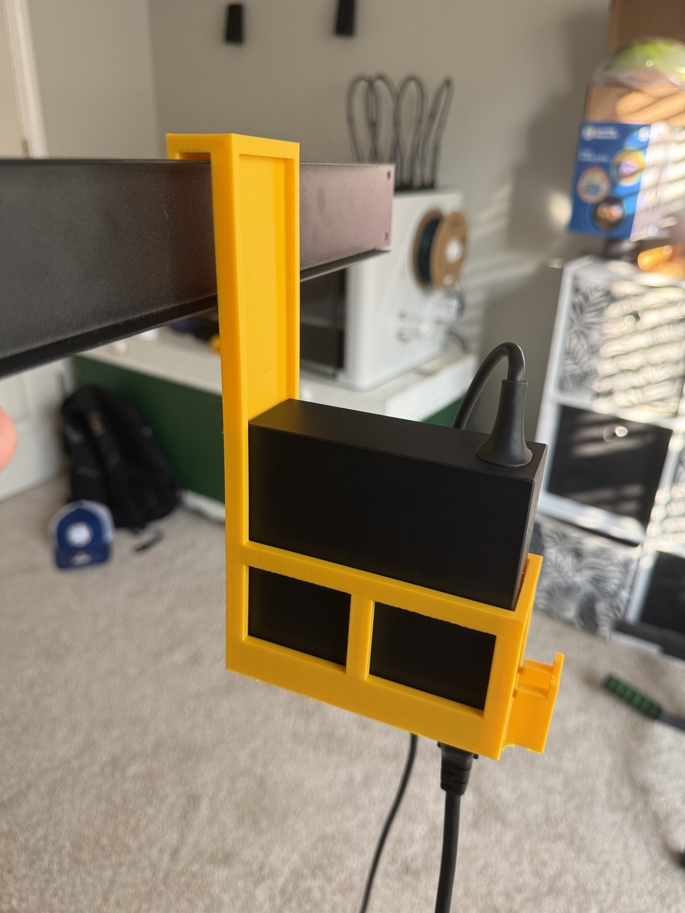

## Production prints and installation

Once the fit was proven, I printed the production supports in green. Printing
them in pairs made the long supported geometry easier to inspect before I
removed the supports and installed the parts.

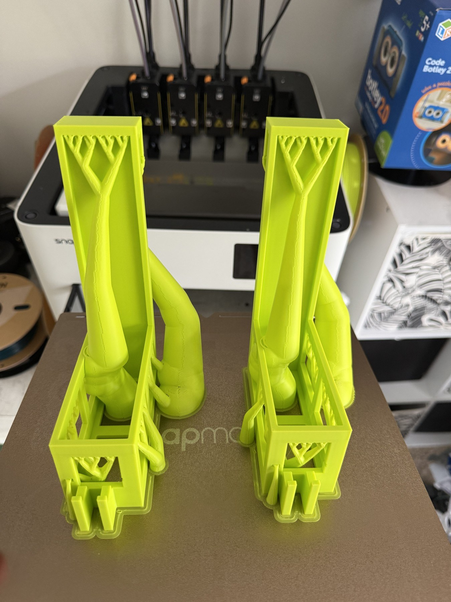

The completed parts mount to the rack, support the PSU body, retain the brick,
and leave open volume underneath rather than returning the warm hardware to a
flat pile.

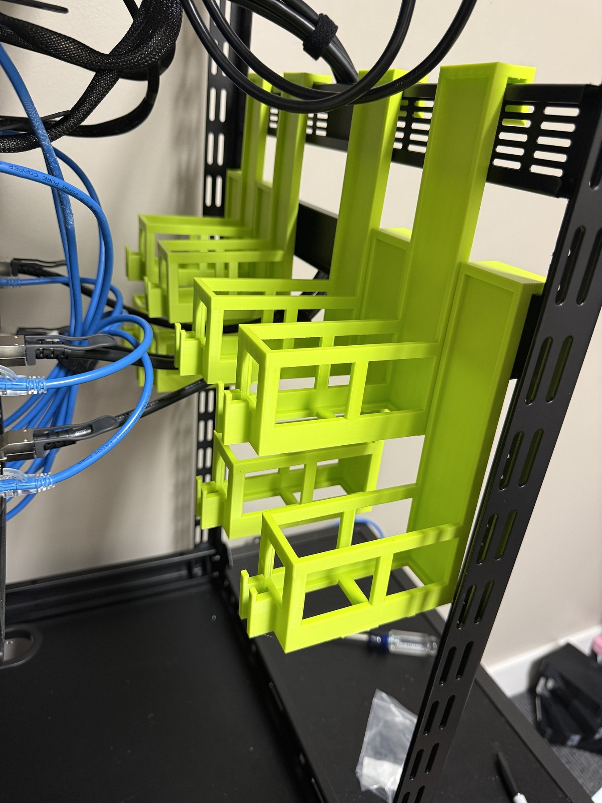

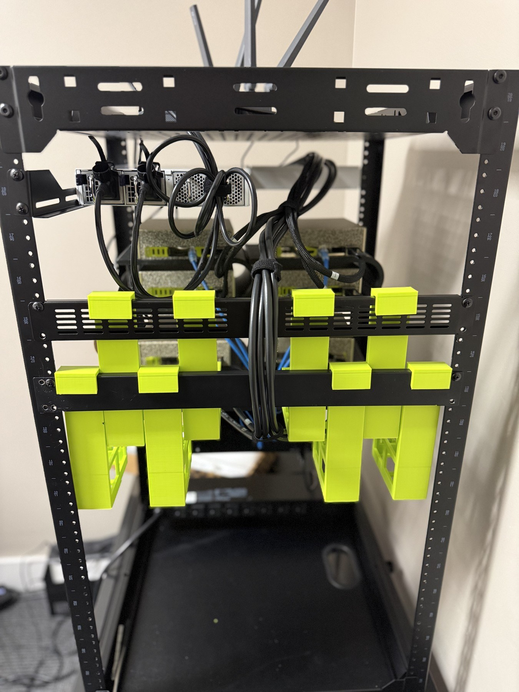

## Fan placement

The fan sits below the raised PSUs and pushes room air upward through the space
opened by the printed supports. The fan remained a separate environmental load;
compute and infrastructure power did not inherit a temperature program.

The fan was connected through an AC Infinity eight-outlet environmental power
controller. Its rack-local probe supplied temperature, humidity, and VPD. The
installed photo records the controller, fan, and probe relationship without
publishing the exact outlet selector or controller identity.

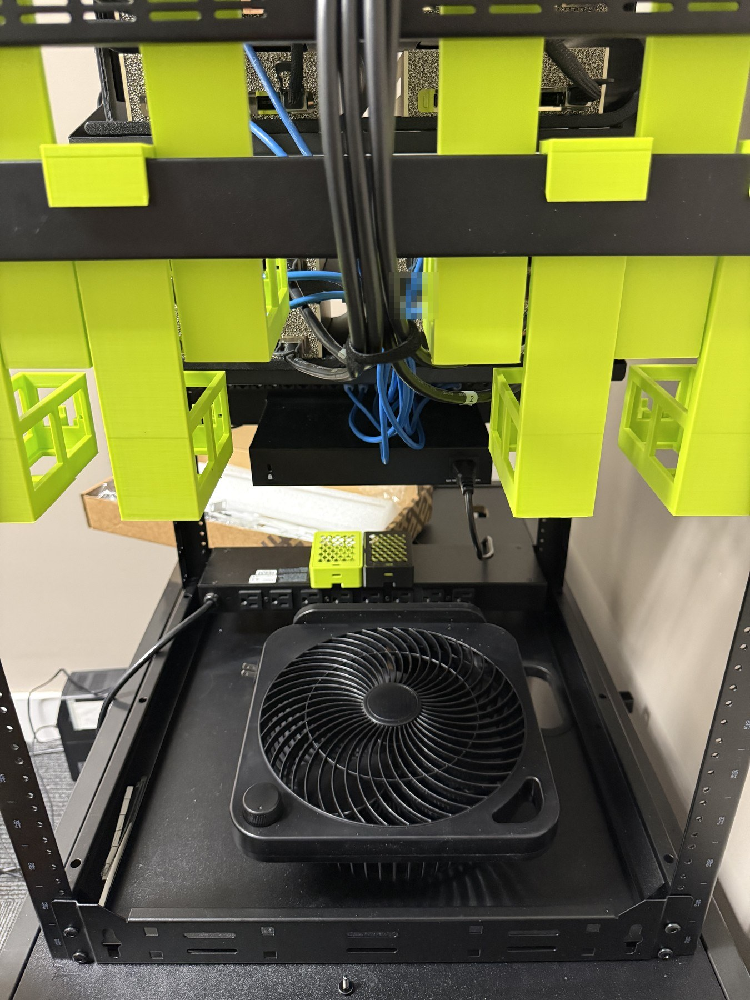

The resulting rack is shown from both sides. I reviewed and approved the visible
Spark names, power-unit names, equipment model markings, rack labels, and
cabling. The public JPEGs retain those pixels while removing the original image
metadata.

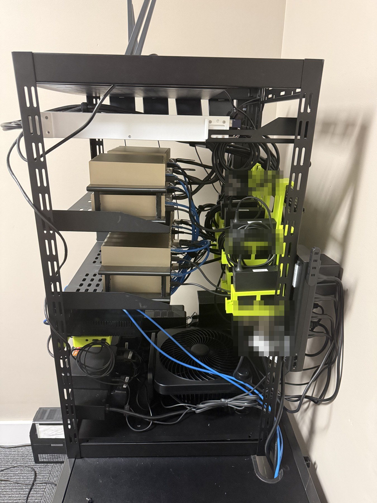

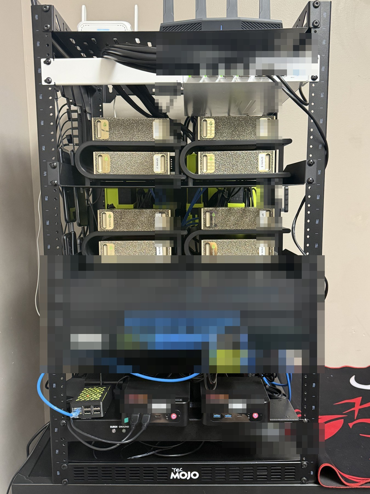

## Bounded fan proof

The test was deliberately narrow. It was meant to prove that the intended fan
outlet changed state, that the independent readback agreed, and that the rack
probe moved in the expected direction. It was not an airflow calibration.

| Step | Fan state | Rack probe | Interpretation |
| --- | --- | ---: | --- |
| Stable baseline | ON | `82.4 F` | Starting observation |
| Two-minute bounded interval | OFF | `82.8 F` | `+0.4 F` with the fan stopped |
| Immediate post-restore read | ON | `82.9 F` | Too early to claim recovery |
| Later independent readback | ON | `82.5 F` | `-0.3 F` from the OFF reading |

The Raspberry Pi issued only the fan OFF and ON commands. The official app
independently verified the relay state and probe value, and every protected
outlet remained ON.

Two additional rack/reference snapshots recorded `84.0 F` inside versus
`78.1 F` outside and, later, `82.7 F` inside versus `77.9 F` outside. Those are
context observations, not part of the matched two-minute differential.

## Result boundary

This work demonstrates:

- a measured mechanical fit correction rather than a cosmetic print;
- a repeatable way to support and service all eight PSU bricks;
- clear space below the warm hardware instead of a concentrated pile;
- a dedicated upward fan path;
- identity-bound fan OFF/ON control with independent state verification; and
- a bounded `+0.4 F` rise followed by a later `-0.3 F` recovery.

It does not claim measured CFM, sealed-rack behavior, long-term thermal capacity,
automatic production fan control, or a maximum safe workload temperature.
